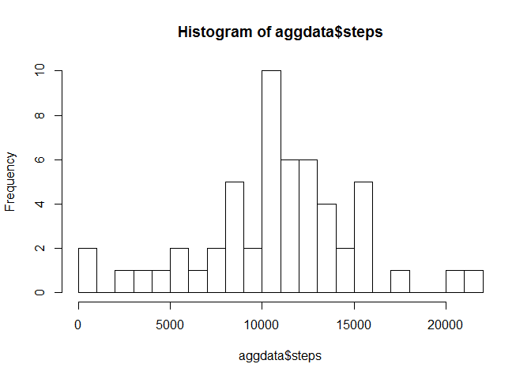

# Reproducible Research: Peer Assessment 1


## Loading and preprocessing the data
Step 1 - Extract the data within the activity.zip file. The activity.zip file contains only one file activity.csv, so I didn't bother building too many smarts into my routine.
Step 2 - Read the data into a Data.Frame.


```r
unzip("activity.zip")
data <- read.csv("activity.csv")
```


## What is mean total number of steps taken per day?
Step 3 - Aggregated the steps by date, using sum as the fucntion
Step 4 - Plotted Histogram of aggregated step data

```r
aggdata <- aggregate(steps ~ date, data=data, sum)
hist(aggdata$steps, breaks = 25)
```

 

Step 5 and 6 - Calculate the Mean and Medium

```r
mean(aggdata$steps)
```

```
## [1] 10766
```

```r
median(aggdata$steps)
```

```
## [1] 10765
```


## What is the average daily activity pattern?
Step 7 - Aggregate the steps by internal period, using mean as the function
Step 8 - Produced line plot, with interval as the x-axis and steps for the y-axis

```r
aggdata2 <- aggregate(steps ~ interval, data=data, mean)
plot(aggdata2, type = "l")
```

 

Step 9 - Ordered the aggregated step data, and then selected the first instance to show the highest step date in the set.

```r
x <- order(aggdata2$steps, decreasing = TRUE)
aggdata2[x[1],]
```

```
##     interval steps
## 104      835 206.2
```


## Imputing missing values


## Are there differences in activity patterns between weekdays and weekends?
