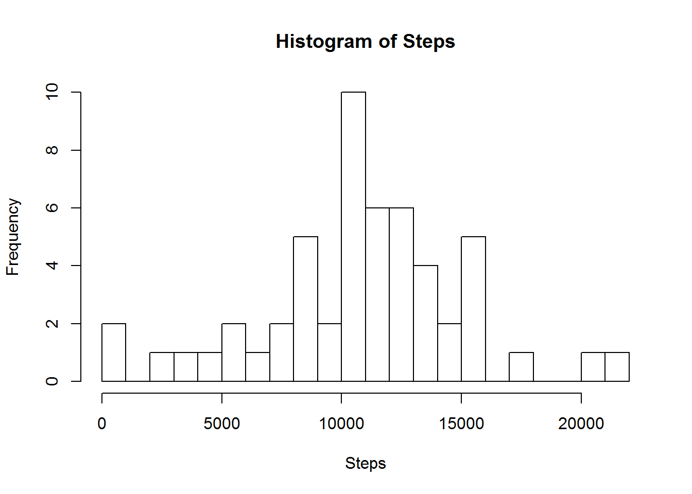

# Reproducible Research: Peer Assessment 1


## Loading and preprocessing the data

1. Unpackage data file from within the *activity.zip* file. Read the data file *activity.csv* into a data.frame.

NOTE: I assumed only the data file *activity.csv* is within the zip file. Hence, I my routine does not check for multiple files, file names etc.

```r
unzip("activity.zip")
data <- read.csv("activity.csv")
```


## What is mean total number of steps taken per day?
1. Aggregate the steps by date, using sum as the function. Plotted a Histogram of aggregate step data.

```r
aggdata <- aggregate(steps ~ date, data=data, sum)
hist(aggdata$steps, breaks = 25, xlab = "Steps")
```

 

2. Calculate the _Mean_ and 

```r
aggdataMean <- mean(aggdata$steps)
aggdataMedian <-median(aggdata$steps)
print(paste("The mean is", aggdataMean))
```

```
## [1] "The mean is 10766.1886792453"
```

```r
print(paste("The medium is", aggdataMedian))
```

```
## [1] "The medium is 10765"
```


## What is the average daily activity pattern?
1. Aggregate the steps by interval period, using mean as the function. Produced a line plot, with interval as the x-axis and steps for the y-axis


```r
aggdata2 <- aggregate(steps ~ interval, data=data, mean)
plot(aggdata2, type = "l")
```

 

2. - Ordered the aggregated step data, and then selected the first instance to show the highest step date in the set.

```r
orderAggData2 <- order(aggdata2$steps, decreasing = TRUE)
maxAggData2 <- aggdata2[orderAggData2[1],]
print(paste("The maximum 5-minute interval average across all days is", row.names(maxAggData2)))
```

```
## [1] "The maximum 5-minute interval average across all days is 104"
```


## Imputing missing values
1. Report the total number of rows with missing data (i.e. NA)

```r
print(paste("The total number of rows with missing step data is", sum(is.na(data$steps))))
```

```
## [1] "The total number of rows with missing step data is 2304"
```


## Are there differences in activity patterns between weekdays and weekends?


